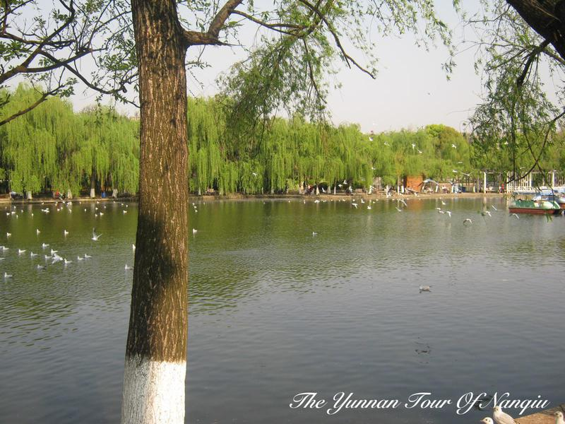
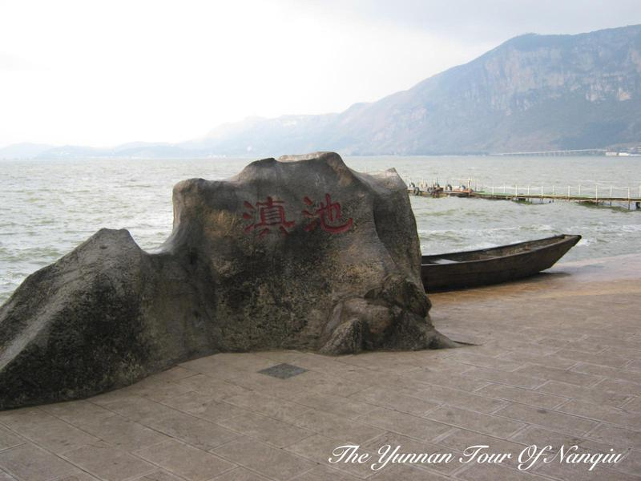
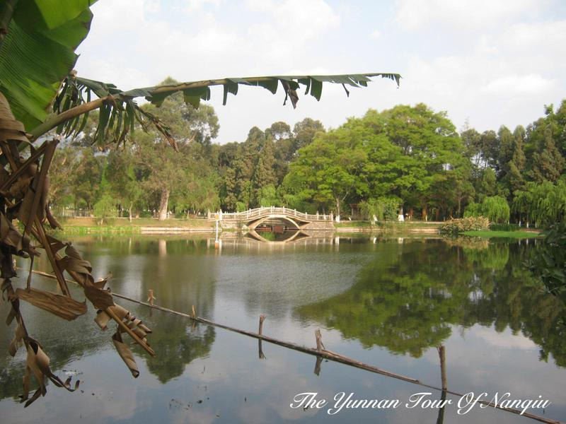
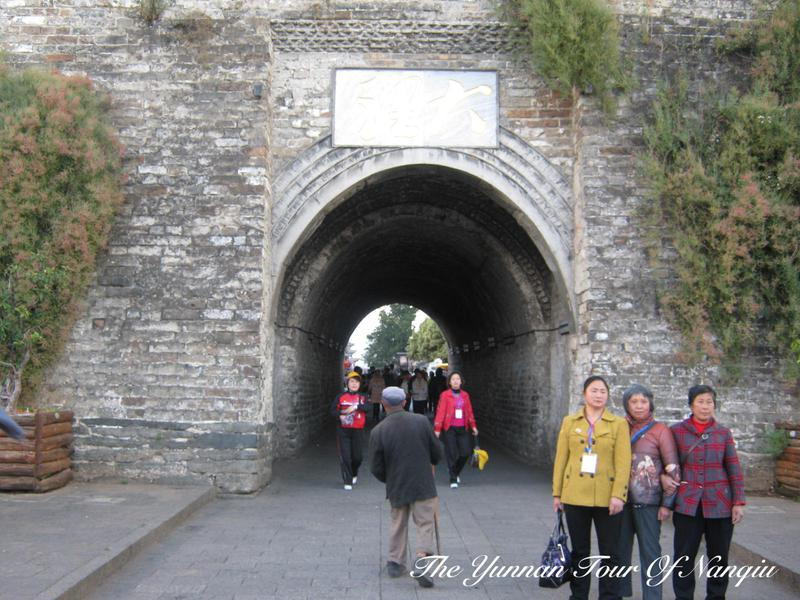
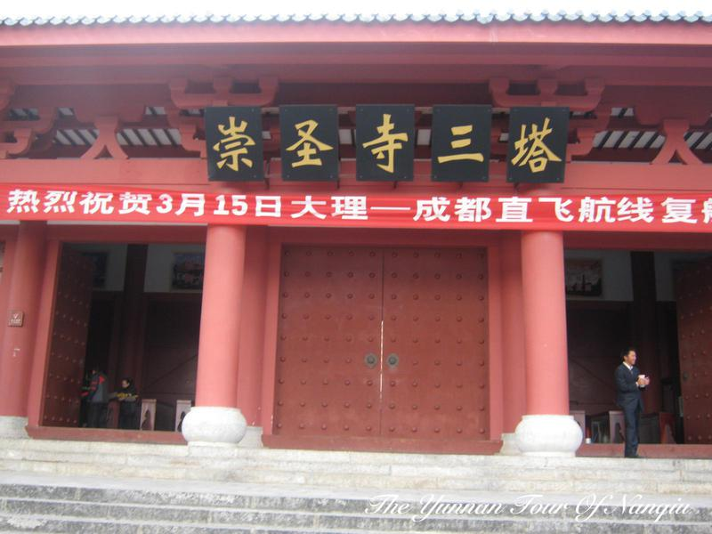
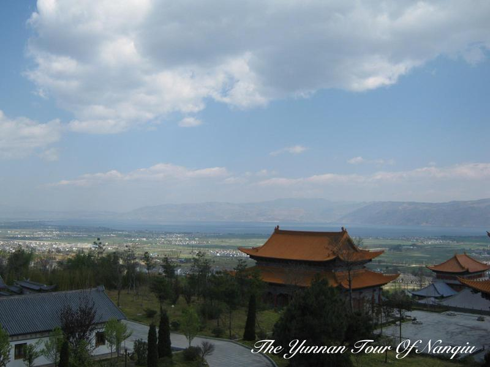
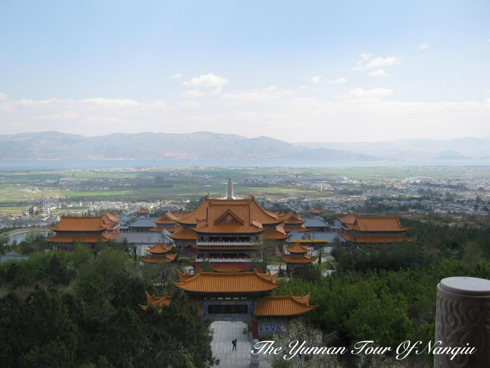
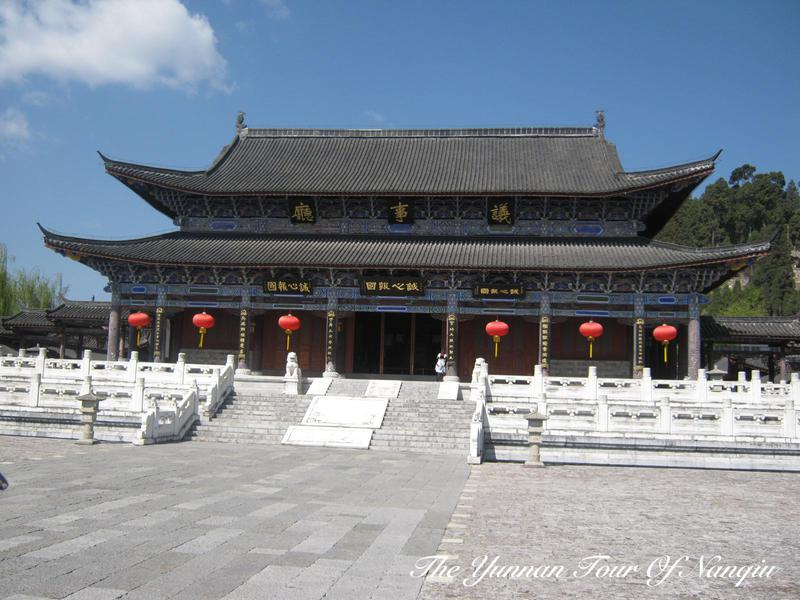
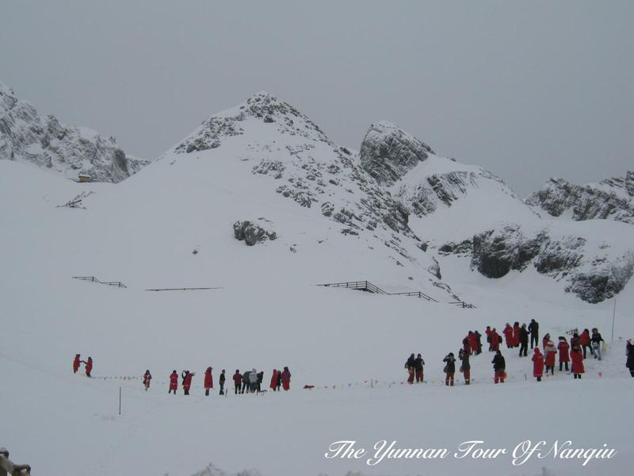
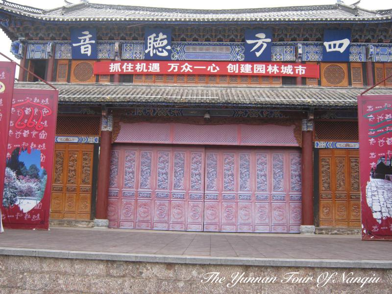

# 云南行

上个月, 和女友在云南待了九天, 好好的休息了一下.

一直以来, 对云南都非常的向往, 很想很想去那么一个神秘而美丽的地方, 这个愿望终于在今年实现了, 而且还和我最心爱的人一起去的, 非常的开心, 嘿嘿!

## 昆明

云南的第一站是昆明, 感觉就a是空气好干, 到的第一天就流鼻血了… 持续了好几天… 第一天去了翠湖, 翠湖很美, 去的时候还有海鸥, 第一次见哈~ 对昆明的第一印象很好, 接着去了金马碧鸡坊, 吃了过桥米线, 感觉一般哈.

云南的最后一站也是昆明, 最后一天去了滇池, 滇池在我印象中也算有名的, 但是去了之后, 感觉好差劲. 昆明最最差劲的就是厕所, 就没上过一个稍微干净一点点的厕所, 恶心死了!!!!!

## 大理

大理, 从看天龙八部时开始知道大理, 听说风花雪月, 也是非常期待的一个地方. 不过行程安排的太少了, 没有登苍山, 看洱海, 是个遗憾.

大理是行程中最满意的一个地方, 有好吃的, 有好看的, 玩的很开心. 大理的风光很美, 在古城就可以看到苍山. 去了崇圣寺三塔, 因为它很有名, 所以去了, 此行没有白去. 崇圣寺很大, 背依苍山, 面朝洱海, 在最后方的望海楼上可以欣赏到这一切的美景. 在山门口吃了一顿素斋, 感觉是云南这趟旅行中吃到的最好吃的一顿: 洱丝, 米线, 喜洲粑粑.

## 丽江

在丽江待的时间是最久的, 一共呆了 6 天的时间, 整个古城转了个遍. 可能是对丽江的期待太高了, 实际到丽江后, 并没有想象的那么好, 也没有想象的那么美, 它跟江南的小镇比, 真的不算什么. 但是, 到了最后要走的时候, 坐在古镇的椅子上, 静静的, 突然感觉其实这样挺好, 就这么的和心爱的人呆呆的坐着, 感受古镇的气息, 感受来往的路人.

### 木府

到丽江去的第一个地方就是木府, 木府还是很值得一去的, 里边有导游讲解, 听下来基本上对丽江的民俗文化有了比较多的认识. 同时也可以感受古代劳动人民的智慧与结晶… 在木府的后山上可以俯瞰整个丽江古镇, 挺好的哈.

### 玉龙雪山

因为没去了香格里拉的梅里雪山, 所以去了玉龙雪山, 到达了海拔 4603 米的雪山上, 其实还是很美的, 不过, 除了雪, 就是人, 没啥… 由于跟的是团, 所以还去了蓝月谷, 玉水寨, 东巴谷, 感觉都很一般, 特别是东巴谷, 垃圾中的垃圾!!! 一天下来的感觉是, 跟团不靠谱啊…

### 束河古镇

束河古镇比大研古镇更古老, 商业化气息也稍微淡一些, 特别是当走进束河古镇里边的时候, 感觉很自然, 很舒适, 束河古镇还是很不错的, 要慢慢的体会….

### 黑龙潭

黑龙潭的位置比较好, 所以风景也比较好, 在黑龙潭可以远眺玉龙雪山, 基本上是最佳的拍摄地点, 环境也不错哈.

……… 此处略去 n 个字 ………

在丽江, 没有吃到好吃的, 真没啥好吃的…

不过, 玩的很开心哈~
