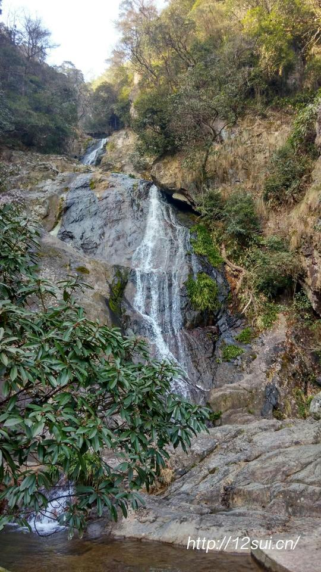

# 东天目山

去年登了西天目，就想着把东天目一起玩掉，一直拖到了 2016 年，第一天，不能忍了，必须要去了。

出发的较晚，高速堵车封道，一路省道过去的，相比西天目来说，东天目的交通条件并不好，比较难找也比较难走。

历尽千辛万苦，终于来到了东天目的东门。购票后，乘景交上山，这里上山的路很窄，只能同时走一辆车，当然车也只有一辆。这天并没有什么人来，所以，基本上等同于包车上山……路程并不远，如果时间充裕，其实并没有必要坐景交，直接走上去也并不费事。

>天目山的东天目位于临安县城西北23.5公里处，有飞泉、奇石、云峰、大树、茶叶、笋干等六绝，主峰大仙峰海拔1479米。

拾阶而上，一路山水相伴。水边的石头都被涂上了各种可爱的卡通图案，另有一番风趣。

东天目比较有名的是东西两瀑，可惜这个季节雨量不大，自然瀑布没有那么的壮观。

这里的大仙峰并没有开放，但还是抱着试一试的心态冲上去。到了上边的地藏殿，拜了下，向里边的尼姑打听这边是否可以到达大仙峰，被告知时间有点晚，一个人上去不安全，还是下次早些和人一起登顶较好，于是只好做罢，算是一个遗憾吧，今年，必须要走一趟七尖！
